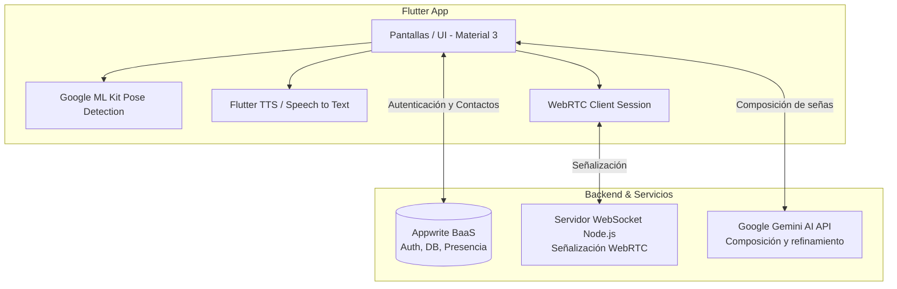

# GestoSystem — Conecta LSB 🤟

[](https://flutter.dev)
[](https://dart.dev)
[](https://webrtc.org)
[](https://appwrite.io)
[](https://ai.google.dev)
[]()

Plataforma de comunicación accesible e inclusión social diseñada para eliminar las barreras de comunicación entre la comunidad sorda usuaria de **Lengua de Señas Boliviana (LSB)** y personas oyentes. 

El sistema integra **traducción doble canal en tiempo real**, **videollamadas WebRTC accesibles** con subtitulado simultáneo, y una **academia interactiva** con validación gestual por visión computacional.

---

## 🚀 Características Principales

### 1. 🔄 Traducción Doble Canal en Vivo
- **Señas a Voz y Texto**: Mediante la cámara del dispositivo, el motor de visión computacional captura los puntos articulares de manos y cuerpo con Google ML Kit Pose Detection. Un agente de IA asistido por la API de Google Gemini refina las secuencias gestuales en oraciones fluidas en español, vocalizándolas instantáneamente con Text-to-Speech (TTS).
- **Voz a Texto**: Captura la voz del interlocutor oyente mediante Speech-to-Text y la proyecta en pantalla grande con alta legibilidad para el usuario sordo.

### 2. 📹 Videollamadas Accesibles en Tiempo Real (WebRTC)
- Comunicación punto a punto (P2P) de video y audio con ultra baja latencia mediante `flutter_webrtc`.
- Servidor de señalización propio basado en WebSockets y Node.js (`realtime-server`).
- Capa de traducción e interpretación simultánea superpuesta directamente sobre el stream de la llamada.

### 3. 🎓 Academia LSB Interactiva
- Diccionario y catálogo visual de señas categorizadas (saludos, emergencias, salud, familia).
- Modo de práctica con cámara en vivo: evalúa la postura de manos y cuerpo frente a la pantalla y brinda feedback visual inmediato.

### 4. 💬 Chat y Agente de Asistencia IA
- Mensajería directa entre usuarios y gestión de contactos con sincronización en tiempo real vía Appwrite.
- Agente inteligente integrado para soporte y consultas de vocabulario en LSB.

---

## 🏗️ Arquitectura del Sistema



---

## 📁 Estructura del Proyecto

```text
├── android/                 # Configuración nativa Android (permisos de cámara y audio)
├── assets/                  # Vocabulario LSB, guías y recursos de audio
├── lib/
│   ├── main.dart            # Punto de entrada y ciclo de vida de la aplicación
│   ├── screens/             # Módulos de UI (Traducción, Videollamada, Academia, Chats)
│   ├── services/            # Servicios de ML Kit, WebRTC, Appwrite, Gemini y Audio
│   └── widgets/             # Componentes reutilizables y superposiciones de llamada
├── realtime-server/         # Servidor WebSocket en Node.js para señalización WebRTC
└── specs/                   # Especificaciones funcionales y arquitectura del proyecto
```

---

## 🛠️ Tecnologías Utilizadas

- **Framework Móvil**: [Flutter](https://flutter.dev) (Dart)
- **Visión Computacional & ML**: `google_mlkit_pose_detection`, `camera`
- **Streaming de Video en Vivo**: `flutter_webrtc`, WebSockets
- **Servidor de Señalización**: Node.js, `ws`
- **Backend as a Service**: [Appwrite](https://appwrite.io)
- **Inteligencia Artificial**: Google Gemini API
- **Accesibilidad**: `flutter_tts`, `speech_to_text`

---

## ⚡ Guía de Instalación y Ejecución

### Requisitos Previos
- **Flutter SDK** (v3.0 o superior)
- **Android SDK** con dispositivo físico Android (recomendado para aceleración ML Kit) o emulador
- **Node.js** (v18 o superior) para el servidor de señalización

### 1. Iniciar el Servidor de Señalización Realtime
```bash
cd realtime-server
npm install
npm start
```

### 2. Ejecutar la Aplicación Móvil
```bash
# En el directorio raíz del proyecto
flutter pub get
flutter run
```

---

## 👥 Autores y Colaboradores

- **Ronald Augusto R** ([@RonaldGaymer2002](https://github.com/RonaldGaymer2002))
- Equipo Conecta LSB — Proyecto desarrollado para el **Cursor Buildathon Bolivia 2026** (Track Social Impact AI).

---

## 📄 Licencia

Este proyecto está distribuido bajo la licencia MIT. Consulta el archivo `LICENSE` para más información.
